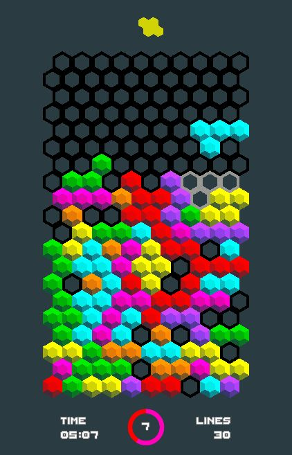

# Year of Unity - April, May & June: Hextris

  

My fourth not-quite-monthly game of 2022. It's 2.5 months late, though not for lack of trying. This one is a twist on the popular game [Tetris](https://en.wikipedia.org/wiki/Tetris), using a hexagonal board and shapes in place of the original rectangular arrangement. The usual 'fill a row to clear it' rule applies and the game ends when the player runs out of room to place new pieces on the board. The zig-zag arrangement of the board introduces several interesting twists, including the fact that shapes can (in general) be rotated 60 degrees (instead of the usual 90) and that blocks cannot fall straight down!

## Other People's Assets
This game uses several assets which are not my own, they are as follows:
- Pixel Font from [Tiny Worlds](https://assetstore.unity.com/packages/2d/fonts/free-pixel-font-thaleah-140059#description)
- Background music from [The Intergalatic Beets Project](https://assetstore.unity.com/packages/audio/music/electronic/the-intergalactic-beets-project-full-length-song-collection-i-199984#description)
- Sound effects from [Dustyroom](https://assetstore.unity.com/packages/audio/sound-fx/free-casual-game-sfx-pack-54116#description)
- The unpronouncable [Bosca Ceoil](https://boscaceoil.net/) was used to make a simple Tetris theme for intro music

## Goals
As with previous YoU entries, the goal here was to better learn Unity and C# and oooh boy was this one a challenge. Aside from the unexpected difficulty dealing with sequencing and animations, there were a few topics I had meant to focus on for this project:

#### Hexagonal grid
For some reason, I was interested in better understanding hexagonal grids, both how to construct them (with code) but also handling movement within them. I also figured the original Tetris would be 'too easy' (which was a mistake) and thought the hex grid might spice things up a bit. While I can't say I thoroughly understand hexagonal grids now (it ended up being easier to treat it as a rectangular grid with gaps), I will say that [Red Blob Games](https://www.redblobgames.com/grids/hexagons/) was an invaluable resource in understanding the basics of these grids.

#### Sound & Music
Experience with previous games has convinced me that sound & music are in fact essential parts of making (even basic) games, they really bring everything to life. Originally the plan was to have the Tetris theme playing as background music, with the tempo increasing as the game difficulty increased (and maybe drums/other instruments would be added over time). This proved well beyond my musical abilities, so I grabbed something from the Unity asset store instead, [which turned out to be awesome](https://www.youtube.com/watch?v=E0bbfjfA9Tg).

#### Shaders
I've long been fascinated with shaders, mostly because of [shadertoy](https://www.shadertoy.com/) and the often mysterious way that GPUs enable seemingly impossible visual effects. This project has no need for custom shaders, yet I still took the opportunity to create a simple toon-shader for the hex blocks (which is completely unnoticeable, but hey I learned something :P) as well as procedurally generating the level progress ring at the bottom center of the main screen. I wanted to procedurally generate the background grid as well, but that remains beyond my capability/understanding for now.

#### Game Sequencing & Waiting for Animations
This was the issue that made this game take almost 3 months instead of 10 days. In fact, the game was entirely working/playable after 10 days, it just didn't have animations and the code was messy to the point of being nearly unworkable. Trying to get the game to properly 'wait' until clearing or dropping animations had finished seemed like an impossible task using Unity's 'everything has it's own update function' model (at least, with my limited understanding of it). I had tried so hard to avoid writing a 'god' game object with an update function that would just call other objects, since it feels like cheating. However, in the interest of time, I eventually cracked and made a 'game state manager' that handled the game sequences, rather than relying on each object running it's own update function and having things co-ordinate properly together. I really feel like 'manager' classes are a sign of serious problems, yet I can't seem to avoid having to set them up when writing object-oriented code. I think I just don't understand OOP...
On the upside, the state manager gave me a chance to implement a simple [Finite-State-Machine](https://gameprogrammingpatterns.com/state.html), which I feel is a really useful tool to have that I've managed to avoid for so many years. It helps compartmentalizes the logic for different parts of the game, and made 'pausing' game logic during animations a breeze.

#### Scriptable Objects
This wasn't a goal going into the project, it was just an obscure feature that I had heard about. However, it turned out that scriptable objects helped solve one of the biggest mysteries for me using Unity, which is: how they heck do you represent shared data/state without a game object? They still feel a little clunky and unintuitive in some ways (no simple way to handle initial setup?), but they finally prevented me from having a spaghetti mess of objects illogically connected to each other. I found two conference videos, one in [2016](https://www.youtube.com/watch?v=6vmRwLYWNRo) and the other in [2017](https://www.youtube.com/watch?v=raQ3iHhE_Kk) that were a big help making sense of these things. And wow that means they've been named terribly for over 5 years!

## Future work
There are so many improvements to be made and it sort of pains me not to add at least some of these things given how much time I've already spent on it, but I think I've re-written the game about 8 times already trying to get animations working and I think I need to move on...
- Better hex visuals (e.g. adding cracks/wear & tear to each hex block with normal maps)
- Better animation effects (e.g. blocks exploding or crumbling when cleared?)
- Better background visuals (wispy particle effects maybe? Not really sure...)
- Adding power-ups. One to knock out a region, one to fill a region, one for temporary slow-mo etc. This was originally planned to be in the game but was cut for time
- Multiple levels. Maybe making it so that you just have to 'survive' long enough to get to each level
- Better points/scoring system (currently just a row clear counter + timer)
- Some incentive to use the fast drop (other than boredom)
